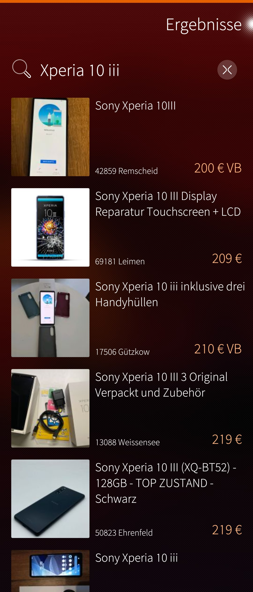
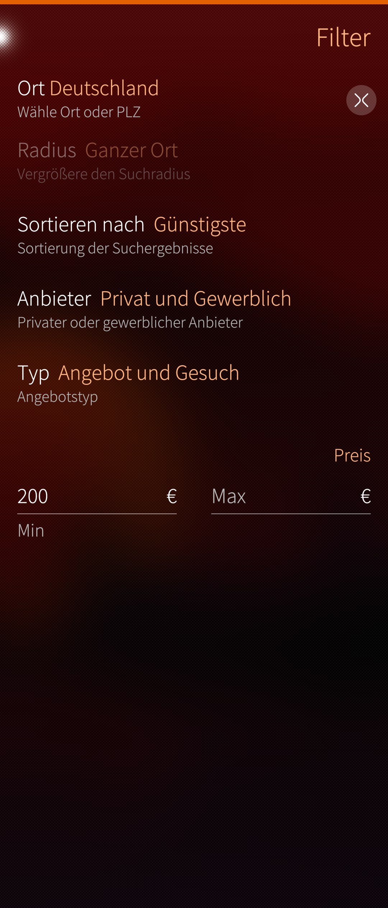
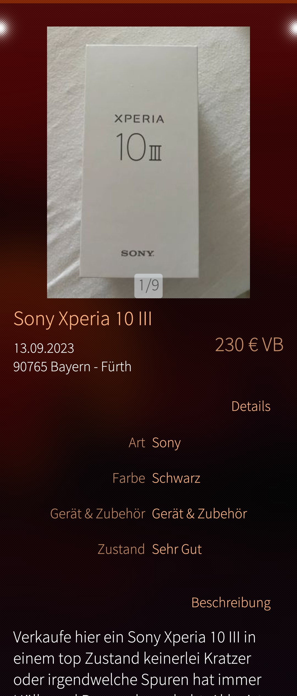

# Kleinanzeigen Viewer


Basic Kleinanzeigen.de App for Sailfish OS  
Search, a few filters and item view is working  
There are a few bugs and not all features of the website are working in this app, but this is only for my free time - don't expect too many updates  

**Roadmap**  
Bugfixing  
Zoom into images  
Offline error message  
Optimize RAM usage  
Save items as favourites  
Item categories in filter page  
Automatic next page loading  

---
This app uses Kleinanzeigen Parser © by me  
https://github.com/stoefelz/kleinanzeigen_parser

# Installing
Download the rpm and install the app - before the first start, execute:  
```
pkcon refresh
pkcon install python3-pip
devel-su pip3 install bs4
```

# Screenshots
<div style="display:flex;">
  
  
  

</div>
<p>

The main goal of this project is to get a rough idea of how to create a Sailfish OS app. 


