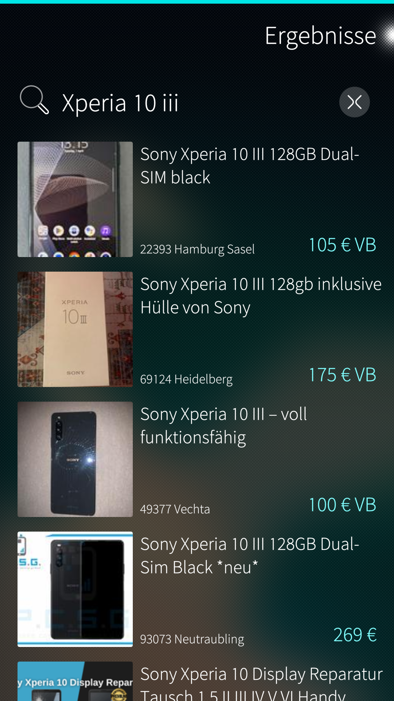
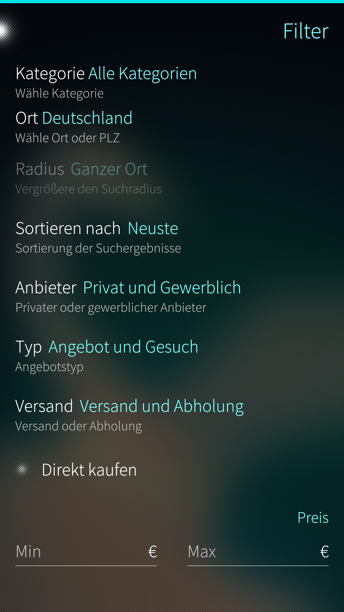

# EK-Viewer
Basic Ebay Kleinanzeigen App for Sailfish OS  
Search, a few filters and item view is working  
There are a few bugs and not all features of the website are working in this app, but this is only for my free time - don't expect too many updates  

This app uses ek_simple parser © by me  
https://github.com/stoefelz/ek_simple_parser

# Installing
Download the rpm and install it - before the first start execute  
``pkcon refresh``  
``pkcon install python3-pip3``  
``devel-su pip3 install bs4``

# Screenshots

  
  
  
  

The main goal of this project is to get a rough idea of how to create an Sailfish OS app. 

